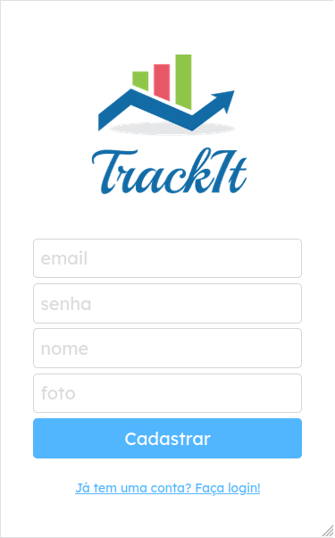
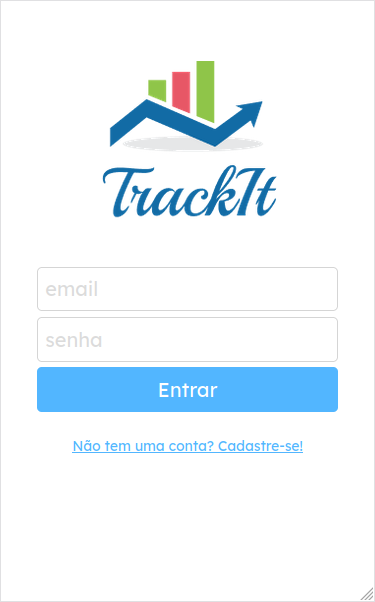
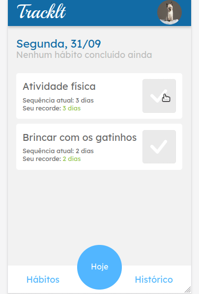
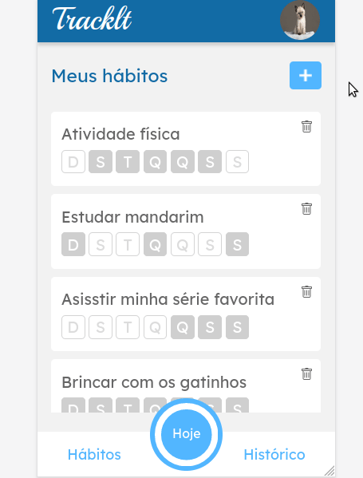
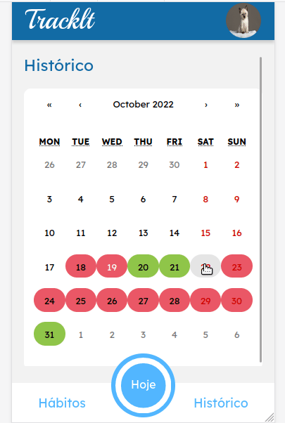
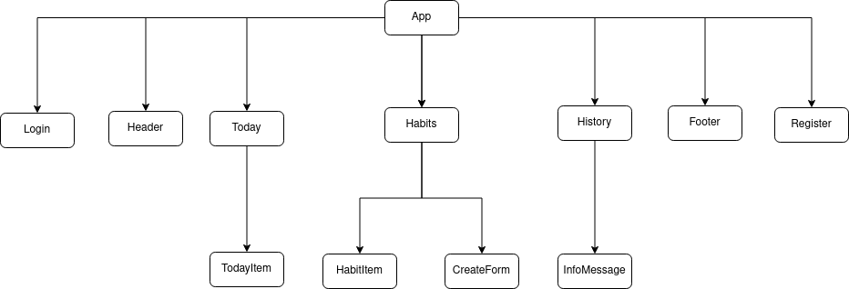

# Project 11: Tracklt [React]


## About

This is a habit tracker mobile app, using **React**. Below are the implemented features:

<details>
    <summary>Sign Up</summary>


</details>

<details>
    <summary>Login</summary>


</details>

<details>
    <summary>Today</summary>


</details>

<details>
    <summary>Habits</summary>


</details>

<details>
    <summary>History</summary>


</details>


<!-- The user can organize their habits for the week. Every day, a checklist is shown, and the user can mark off tasks as they are finished. All the reports given since the initial login are displayed in the history: days with all habits completed are highlighted in green; red if they're not. All the reports given since the initial login are displayed in the history: days with all habits accomplished are marked in green; days without are highlighted in red. -->

Try it out now at https://projeto11-tracklt.vercel.app/

## Project Basic Structure

  

## Technologies

The following tools and frameworks were used in the construction of the project:<br>
<div>
    
    
    
    
    
</div>

## How to run

1. Clone this repository

2. Install dependencies
```bash
npm i
```
3. Run the project
```bash
npm start
```
4. You can optionally build the project running
```bash
npm run build
```
5. Finally access http://localhost:3000 on your favorite browser (unless it is Internet Explorer. In this case, review your life decisions)
